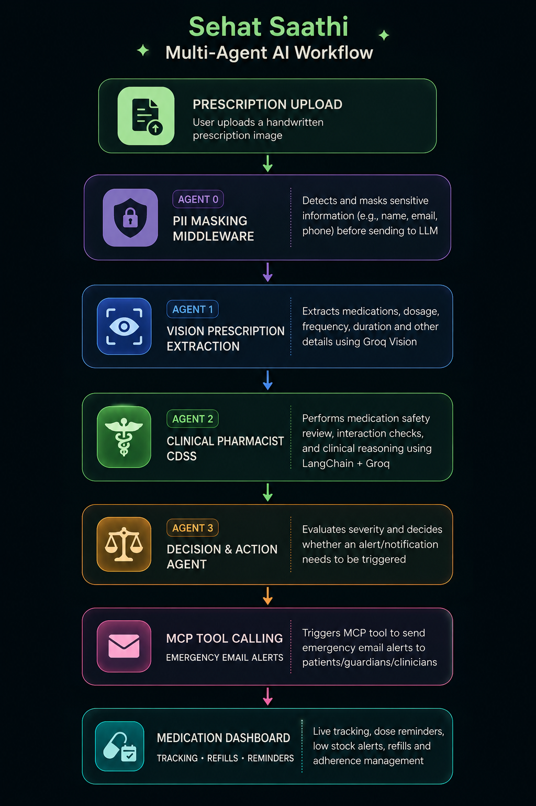

# Sehat Saathi

### AI-Powered Multi-Agent Clinical Decision Support & Medication Concierge

**Kaggle Google AI Agents Hackathon 2026 Submission**

### Transforming handwritten prescriptions into intelligent medication safety workflows using Multi-Agent AI.

---

# Multi-Agent AI Workflow

  

---

# Overview

Every day, millions of patients forget doses, misunderstand prescriptions, or unknowingly combine medications that may interact.

Sehat Saathi is an AI-powered Medication Concierge that transforms a handwritten prescription into a safe, intelligent, and interactive medication management experience.

Instead of simply extracting text, Sehat Saathi orchestrates multiple AI agents that understand prescriptions, identify clinically meaningful medication risks, automate reminders, monitor inventory, and proactively help patients stay adherent to treatment.

---

# Why Multi-Agent AI?

Traditional OCR systems simply extract text from prescriptions. 

Sehat Saathi goes beyond OCR by orchestrating multiple AI agents that collaborate to:

- Understand handwritten prescriptions
- Review medication safety
- Trigger autonomous actions when required
- Improve patient adherence through reminders and inventory tracking

This modular architecture allows future integration with standardized clinical knowledge bases such as RxNorm, SNOMED CT, HL7 FHIR, and DrugBank.

---

# Core Features

## 1. Prescription Analysis Pipeline (Multi-Agent System)

- **Agent 1: Extraction Agent** — Securely extracts medications, dosages, frequencies, and duration from an uploaded prescription image.
- **Agent 2: Pharmacist Analyst** — Checks for critical drug-drug interactions between the newly prescribed medications and the patient's existing inventory.
- **Agent 3: Decision & Action Agent** — Determines if an alert needs to be sent based on interactions, and securely triggers email warnings via a Model Context Protocol (MCP) tool.
- **Privacy First (PII Masking)** — A custom Express middleware intercepts sensitive fields (like Patient Name and Email) and masks them before they ever reach the LLM, ensuring HIPAA-level compliance.

---

## 2. Live Medication Tracker (CDSS Dashboard)

- **Premium UI** — Built with Next.js, Framer Motion, and Lucide icons using Antigravity design principles (glassmorphism, subtle pulses, and dark sage styling).
- **Inventory Management** — Extracts are seamlessly saved to a local JSON inventory, tracked per user.
- **Dose Consumption** — Patients can click "Take Dose" to optimistically reduce their stock in the UI and log the consumption in the backend.

---

## 3. Automated Refills & Alerts

- **Cron Jobs** — A background Node-Cron service runs every minute to check medication schedules and stock levels.
- **Email Integration** — Automatically sends beautiful HTML emails via Resend when it's time to take a pill. (Note: To comply with Resend API free-tier limits, all live demo alerts are securely routed to the developer's verified inbox while showing a success state in the UI).
- **Low Stock Workflow** — If stock drops to 3 or below:
  - The UI turns red.
  - A "🛒 Order Refill" button appears, linking directly to the 1mg search page for that specific medicine.
  - A subtle "+ Refill" button appears, allowing the user to seamlessly specify how many pills they bought (e.g. +15) to replenish their tracker instantly.

---

# How to Demo to Judges

### 1. Install the dependencies
Install the backend dependencies: `cd backend` and then `npm install`.
Similarly, install the frontend dependencies: `cd frontend` and then `npm install`.

### 2. Start the Server
Make sure both `npm run dev` in frontend and backend are running.

### 3. Upload a Prescription
Use the dropzone to upload a sample prescription. Watch the 4-step loading animation (it looks great on screen).

### 4. Show the Multi-Agent Logic
Point out the terminal logs on the backend showing the PII masking taking effect and the three agents coordinating.

### 5. Dashboard Interaction
Scroll down to the Live Dashboard.
- Click **Take Dose** and watch the stock drop.
- Click the **Simulate Live Alert** cheat button to show them how the automated email reminder looks in your inbox.
- Click **Take Dose** until stock drops to 3. Show how the UI turns red, click **Order Refill** to open 1mg, and then use the **+ Refill** input to restock the inventory.

---

# Tech Stack

## Frontend
- React.js (Next.js)
- Tailwind CSS
- Framer Motion
- Lucide Icons

## Backend
- Node.js
- Express.js
- Custom PII Masking Middleware
- Node-Cron

## AI & Tooling
- Multi-Agent Pipeline (Extraction, Pharmacist, Decision)
- Model Context Protocol (MCP) Integration
- Resend (Email APIs)

---

# Key Engineering Highlights

### Multi-Agent Orchestration
- Coordinated logic spanning three specialized AI agents, ensuring high accuracy and robust interaction checking.

### Privacy-First Architecture
- Built-in HIPAA-aware middleware that sanitizes PII before AI processing.

### Premium User Experience
- Real-time responsive dashboard utilizing glassmorphism and smooth framer-motion animations for seamless interaction.

---

# Problem Statement

Managing multiple medications safely is challenging. Patients often face issues like missed doses, harmful drug interactions, and running out of medicine unexpectedly.

Sehat Saathi addresses this by providing an all-in-one platform that proactively manages prescriptions, analyzes interactions, reminds users of doses, and tracks inventory—all in a highly secure, beautifully designed interface.

---

# Future Roadmap

- RxNorm Medication Normalization
- DrugBank Knowledge Integration
- HL7 FHIR Support
- SNOMED CT Clinical Concepts
- Doctor Dashboard
- Electronic Health Record Integration
- Wearable Device Support
- Voice Medication Assistant
- Personalized AI Medication Coach
- Hospital Deployment

---

# Developers

## Jayant Kumawat

**Backend Developer • AI Engineer**

Responsible for:

- Multi-Agent AI Architecture
- LangChain Agent Orchestration
- Groq LLM Integration
- Clinical Decision Support System (CDSS)
- Vision Prescription Analysis Pipeline
- MCP Integration
- Express.js Backend APIs
- Secure PII Masking Middleware
- Email Automation
- Node-Cron Scheduler

**Portfolio:**
https://fun-project-875083.framer.app/

**GitHub:**
https://github.com/Jayantx07

**LinkedIn:**
https://www.linkedin.com/in/jayantkumawat007/

---

## Kashish Yadav

**Frontend Developer • UI/UX Designer**

Responsible for:

- Next.js Frontend
- Responsive UI
- TailwindCSS Components
- Framer Motion Animations
- Dashboard Experience
- Glassmorphism Design
- User Experience
- Medication Tracking UI

**GitHub:**
https://github.com/KashishYadav09/

**LinkedIn:**
https://www.linkedin.com/in/kashishyadav09

---

# Repository Support

If you find this project valuable:
- Star the repository
- Share feedback

---

# Acknowledgements

Built as part of the **Kaggle Google AI Agents Hackathon 2026**.

This project demonstrates how Multi-Agent AI, Clinical Decision Support Systems (CDSS), and autonomous workflows can improve medication safety and adherence while maintaining a privacy-aware architecture.

---

### Sehat Saathi — Safe, Intelligent, and Automated Medication Management.
